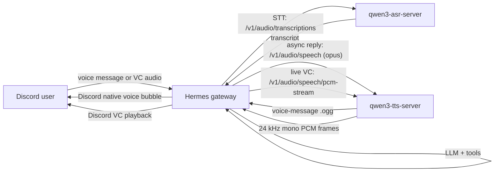

# Use qwen3 ASR and TTS with Hermes

This guide shows how to connect Hermes to:

- [`qwen3-asr-server`](https://github.com/malaiwah/qwen3-asr-server) for speech-to-text
- [`qwen3-tts-server`](https://github.com/malaiwah/qwen3-tts-server) for text-to-speech

The intended result is:

- **Discord voice messages**: user sends a voice message, Hermes transcribes it, thinks, then replies with a native Discord voice bubble when possible
- **Discord voice channels**: Hermes joins a voice channel, transcribes users, and speaks back with low-latency PCM streaming

## Why this pairing

Hermes uses two different output paths on purpose:

- **Async voice-message replies** use full-file TTS
  - Hermes asks qwen3-tts for a complete `.ogg` / Opus file
  - Discord can then receive it as a native voice-message bubble
- **Live voice channels** use token-level PCM streaming
  - Hermes reads qwen3-tts `/v1/audio/speech/pcm-stream`
  - audio starts much sooner, which matters more than completed-file latency

That split is expected. Do not try to force the live voice-channel path onto file output formats.

## Prerequisites

You need:

- Hermes running with messaging support
- a reachable `qwen3-asr-server`
- a reachable `qwen3-tts-server`
- Discord bot setup already working for text

See also:

- [Voice Mode](/docs/user-guide/features/voice-mode)
- [Discord Setup](/docs/user-guide/messaging/discord)
- [qwen3-asr-server README](https://github.com/malaiwah/qwen3-asr-server)
- [qwen3-tts-server README](https://github.com/malaiwah/qwen3-tts-server)

## Example topology



## Hermes configuration

Use `stt.provider: openai` for qwen3-asr because Hermes already knows how to speak the OpenAI STT API shape.

Use `tts.provider: qwen3` for qwen3-tts because Hermes has a dedicated provider integration for it.

### `~/.hermes/config.yaml`

```yaml
stt:
  enabled: true
  provider: "openai"
  model: "Qwen/Qwen3-ASR-1.7B"
  openai:
    base_url: "http://asr-host:8002/v1"
    api_key: "not-needed"
    language: "en"

tts:
  provider: "qwen3"
  qwen3:
    base_url: "http://tts-host:8001"
    voice: "ryan"
    instruct: "Speak naturally and warmly."
    timeout: 120
    languages:
      English:
        voice: "ryan"
        instruct: "Speak naturally and warmly."
      French:
        voice: "vc_ab12cd34"
        instruct: "Parle naturellement en français."
```

### `~/.hermes/.env`

If your qwen3 servers do not require authentication, you do not need speech-specific env vars at all.

```bash
DISCORD_BOT_TOKEN=...
DISCORD_ALLOWED_USERS=123456789012345678
```

If your OpenAI-compatible STT endpoint requires auth and you prefer env-based auth:

```bash
VOICE_TOOLS_OPENAI_KEY=your-token
STT_OPENAI_BASE_URL=http://asr-host:8002/v1
```

Config values take precedence when both config and env are set.

## What each field does

### STT

- `stt.provider: openai`
  - tells Hermes to use the OpenAI speech-to-text API shape
- `stt.model`
  - the top-level model name Hermes passes on gateway voice-message paths
- `stt.openai.base_url`
  - points Hermes at qwen3-asr-server instead of OpenAI
- `stt.openai.api_key`
  - optional; use a dummy string like `not-needed` for unauthenticated local servers
- `stt.openai.language`
  - optional language hint; prefer ISO codes like `en` or `fr`

### TTS

- `tts.provider: qwen3`
  - enables the dedicated qwen3 TTS integration in Hermes
- `tts.qwen3.base_url`
  - qwen3-tts-server base URL
- `tts.qwen3.voice`
  - preset voice, OpenAI alias, or custom clone ID like `vc_ab12cd34`
- `tts.qwen3.instruct`
  - optional style prompt
- `tts.qwen3.languages`
  - per-language overrides for bilingual or multilingual setups

## Voice clones

Hermes can register and use qwen3 voice clones through the normal tool surface:

- `register_voice_clone`
- `list_voice_clones`
- `text_to_speech`

Typical flow:

1. send Hermes a voice message
2. ask Hermes to register that recording as a voice clone
3. Hermes calls `register_voice_clone`
4. Hermes can then use the returned `vc_<id>` in:
   - `text_to_speech(voice="vc_<id>")`
   - `[voice: vc_<id>]` for live voice-channel carry-forward

## Discord behavior notes

### Async Discord voice messages

When a user sends a voice message in Discord:

1. Hermes downloads the audio
2. Hermes calls qwen3-asr-server
3. Hermes runs the normal agent/tool pipeline
4. Hermes calls qwen3-tts `/v1/audio/speech` for a complete audio file
5. Hermes attempts to post the result as a native Discord voice bubble
6. if Discord rejects the native route, Hermes falls back to a normal audio attachment

### Live Discord voice channels

When Hermes is in a Discord voice channel:

1. Hermes buffers PCM from Discord
2. Hermes detects an utterance boundary
3. Hermes transcribes the buffered audio
4. Hermes generates a reply
5. Hermes calls qwen3-tts `/v1/audio/speech/pcm-stream`
6. Hermes streams PCM straight into Discord playback

This is the low-latency path. Keep it on `/pcm-stream`.

## Verification checklist

### Verify qwen3-asr-server

```bash
curl -s http://asr-host:8002/health
```

Then transcribe a sample:

```bash
curl -s -X POST http://asr-host:8002/v1/audio/transcriptions \
  -F model=Qwen/Qwen3-ASR-1.7B \
  -F language=en \
  -F file=@sample.wav
```

### Verify qwen3-tts-server

```bash
curl -s http://tts-host:8001/health
curl -s http://tts-host:8001/v1/voices | jq '.data[0:5]'
```

Generate a Discord-friendly file:

```bash
curl -s -X POST "http://tts-host:8001/v1/audio/speech?text=Hello+from+Hermes&voice=ryan&response_format=opus&language=English" \
  --output hello.ogg
```

### Verify Hermes

1. send a Discord voice message to Hermes
2. confirm Hermes transcribes it
3. confirm Hermes replies with voice
4. run `/voice join` in Discord
5. speak in the voice channel and confirm low-latency spoken replies

## Practical recommendations

- Prefer **English first**, then **French**
- Use qwen3 preset voices first, then add clones only where they materially help
- Keep the async voice-message path on direct `.ogg` / Opus output
- Keep the live voice-channel path on `/pcm-stream`
- Add explicit timing logs when tuning latency so you can separate:
  - STT time
  - LLM/tool time
  - TTS generation time
  - Discord delivery time

## Troubleshooting

### Hermes is using local Whisper instead of qwen3-asr

Check:

- `stt.provider` is explicitly set to `openai`
- `stt.model` is set
- `stt.openai.base_url` points to qwen3-asr-server
- the running Hermes instance actually picked up the latest config

### Discord reply arrives as a file attachment instead of a native voice bubble

Check:

- qwen3-tts output is `.ogg` / Opus
- Hermes is attempting the Discord native voice-message path
- Discord did not reject the native attachment metadata

Hermes will fall back to a normal audio attachment if Discord rejects the native voice-message route.

### Live voice channel replies feel slow

Check:

- Hermes is using `/v1/audio/speech/pcm-stream`, not file output
- your silence detection settings are not too conservative
- the bottleneck is not the LLM turn itself

For live conversational feel, silence detection and LLM/tool overhead usually matter more than raw TTS synthesis time.
