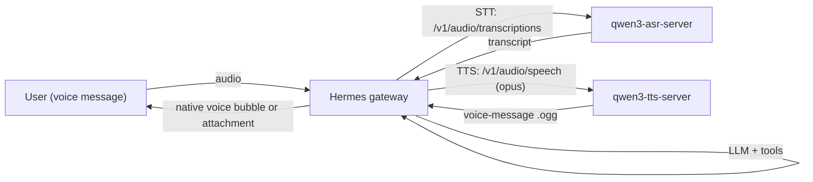

# Use Qwen3 ASR and TTS with Hermes

This guide shows how to connect Hermes to:

- [`qwen3-asr-server`](https://github.com/malaiwah/qwen3-asr-server) for speech-to-text
- [`qwen3-tts-server`](https://github.com/malaiwah/qwen3-tts-server) for text-to-speech

The intended result is that voice messages sent to Hermes (e.g. via Discord, Telegram, WhatsApp) are transcribed by Qwen3-ASR and replies are spoken back through Qwen3-TTS, with optional native voice-bubble delivery on platforms that support Opus.

## Prerequisites

- Hermes running with messaging support
- a reachable `qwen3-asr-server`
- a reachable `qwen3-tts-server`

See also:

- [TTS](/docs/user-guide/features/tts)
- [STT](/docs/user-guide/features/tts#speech-to-text-stt)
- [qwen3-asr-server README](https://github.com/malaiwah/qwen3-asr-server)
- [qwen3-tts-server README](https://github.com/malaiwah/qwen3-tts-server)

## Topology



## Hermes configuration

Use `stt.provider: openai` for qwen3-asr because Hermes already speaks the OpenAI STT API shape and qwen3-asr-server exposes that contract.

Use `tts.provider: qwen3` for qwen3-tts because Hermes ships a dedicated provider integration for it (query-parameter API rather than OpenAI's JSON body).

### `~/.hermes/config.yaml`

```yaml
stt:
  enabled: true
  provider: "openai"
  model: "Qwen/Qwen3-ASR-1.7B"
  openai:
    base_url: "http://asr-host:8002/v1"
    api_key: "not-needed"
    language: "en"

tts:
  provider: "qwen3"
  qwen3:
    base_url: "http://tts-host:8001"
    voice: "ryan"
    instruct: "Speak naturally and warmly."
    timeout: 120
    languages:
      English:
        voice: "ryan"
        instruct: "Speak naturally and warmly."
      French:
        voice: "vc_ab12cd34"
        instruct: "Parle naturellement en français."
```

### `~/.hermes/.env`

If your qwen3 servers do not require authentication, no speech-specific env vars are needed.

If your OpenAI-compatible STT endpoint requires auth and you prefer env-based credentials:

```bash
VOICE_TOOLS_OPENAI_KEY=your-token
STT_OPENAI_BASE_URL=http://asr-host:8002/v1
```

Config values take precedence when both config and env are set.

## Field reference

### STT

- `stt.provider: openai` — tells Hermes to use the OpenAI speech-to-text API shape
- `stt.model` — the model name Hermes passes on transcription requests
- `stt.openai.base_url` — points Hermes at qwen3-asr-server instead of OpenAI
- `stt.openai.api_key` — optional; use a dummy string for unauthenticated local servers
- `stt.openai.language` — optional language hint (ISO codes like `en` or `fr`)

### TTS

- `tts.provider: qwen3` — enables the dedicated qwen3 TTS integration
- `tts.qwen3.base_url` — qwen3-tts-server base URL
- `tts.qwen3.voice` — preset voice, OpenAI alias, or custom clone ID like `vc_ab12cd34`
- `tts.qwen3.instruct` — optional speaking-style hint
- `tts.qwen3.timeout` — request timeout in seconds (default 120)
- `tts.qwen3.languages` — per-language overrides for bilingual or multilingual setups

## Voice clones

Hermes can register and use Qwen3 voice clones through the standard tool surface:

- `register_voice_clone` — uploads a reference audio clip and returns a `vc_<id>`
- `list_voice_clones` — lists all clones registered on the server
- `text_to_speech` — accepts `voice="vc_<id>"` to synthesise with the clone

Typical flow:

1. The user sends Hermes a voice message
2. The user asks Hermes to register that recording as a voice clone
3. Hermes calls `register_voice_clone` with the message's `audio_id`
4. Hermes can then use the returned `vc_<id>` in `text_to_speech(voice="vc_<id>")`

## Verification

### Verify qwen3-asr-server

```bash
curl -s http://asr-host:8002/health
curl -s -X POST http://asr-host:8002/v1/audio/transcriptions \
  -F model=Qwen/Qwen3-ASR-1.7B \
  -F language=en \
  -F file=@sample.wav
```

### Verify qwen3-tts-server

```bash
curl -s http://tts-host:8001/health
curl -s http://tts-host:8001/v1/voices | jq '.data[0:5]'
curl -s -X POST "http://tts-host:8001/v1/audio/speech?text=Hello+from+Hermes&voice=ryan&response_format=opus&language=English" \
  --output hello.ogg
```

### Verify Hermes

1. Send Hermes a voice message
2. Confirm Hermes transcribes it (check logs for the STT call to qwen3-asr-server)
3. Confirm Hermes replies with synthesised audio (check logs for the TTS call to qwen3-tts-server)
4. On platforms with native voice bubbles (Telegram, Discord), confirm the reply arrives as a voice bubble rather than a file attachment

## Troubleshooting

### Hermes is using local Whisper instead of qwen3-asr

Check that:

- `stt.provider` is explicitly set to `openai`
- `stt.model` is set
- `stt.openai.base_url` points to qwen3-asr-server
- The running Hermes instance picked up the latest config

### Reply arrives as a file attachment instead of a native voice bubble

Check that:

- The qwen3-tts output extension is `.ogg` (Opus); Hermes selects this automatically when the platform is Telegram
- The platform actually supports native voice bubbles for the message type
- The audio file is well-formed Opus (test the URL directly with curl)

Hermes falls back to a normal audio attachment if the native voice-message route is rejected.
